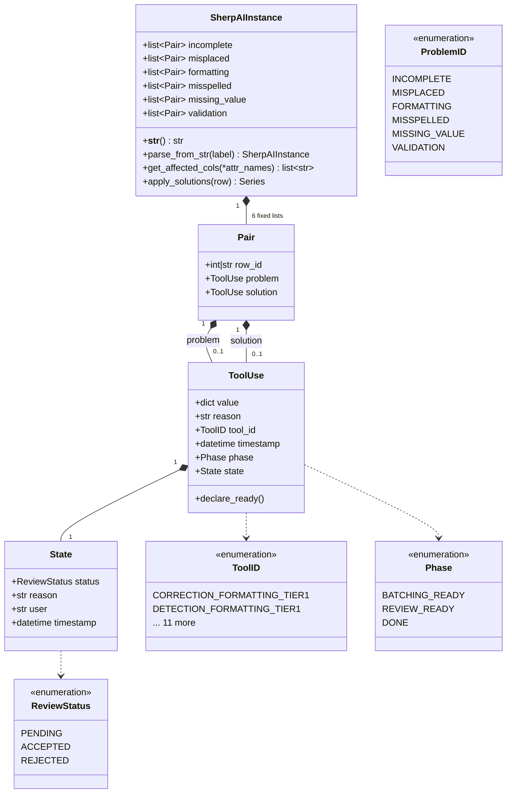
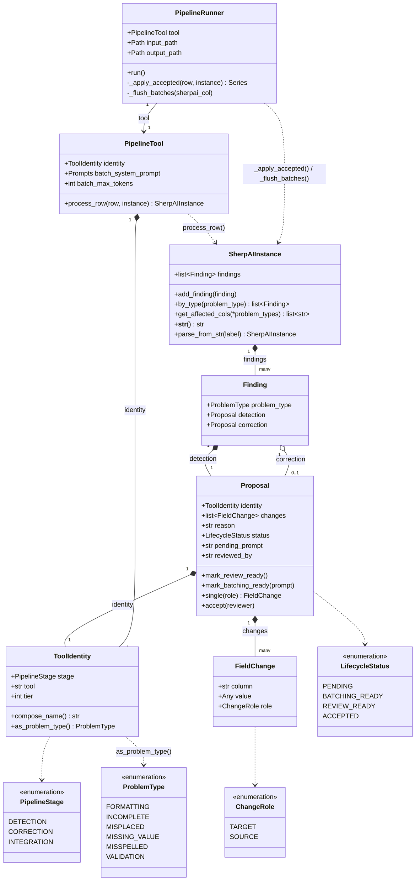

# `sherpai_schemas` architecture: old vs. new

This documents the schema redesign carried out in the TDD rebuild of `sherpai_schemas`
(see `../tests/test_schemas.py` and `llm-orchestration/tests/`). Both diagrams are
UML class diagrams (Mermaid syntax).

## Previous architecture

No shared tool-execution abstraction existed at this layer — there was no
`PipelineTool`/`PipelineRunner` concept at all; batching, "apply accepted
corrections", and lifecycle transitions were left to whatever each caller
implemented individually via `ToolUse.declare_ready()` and the standalone
`sherpai_completion()` function.

## New architecture

## What changed, and why it's better

**One list instead of six parallel ones.** The old `SherpAIInstance` hard-coded a
separate `list[Pair]` field per problem type (`incomplete`, `misplaced`,
`formatting`, ...). Adding a new problem type meant adding a new model field and
updating every method that iterated `SherpAIInstance.model_fields` by hand (see
the old `apply_solutions`, which looped over field names via reflection). The new
`SherpAIInstance` has a single `findings: list[Finding]`, and `by_type()`/
`get_affected_cols()` filter it by `Finding.problem_type`. Supporting a new
`ProblemType` is now a one-line enum addition — no schema-shape change, no
reflection-based code to touch.

**Two levels of nesting instead of three.** The old shape was
`SherpAIInstance → Pair → ToolUse → State`, with `Pair.problem` and
`Pair.solution` as two independently-typed `ToolUse | None` slots. The new shape
is `SherpAIInstance → Finding → Proposal`, where `Finding.detection` and
`Finding.correction` are the *same* type (`Proposal`). Detection and correction
used to be structurally different concepts wearing the same `ToolUse` class;
now they're explicitly the same kind of thing (a proposed change with a
lifecycle), which matches how the tool code actually treats them — e.g.
`finding.correction = finding.correction.model_copy(deep=True)` reuses the
detection's own type rather than reconstructing a different one.

**One lifecycle enum instead of two overlapping ones.** The old design split
"where is this in processing" across `Phase` (`batching_ready`/`review_ready`/
`done`) on `ToolUse` *and* `ReviewStatus` (`pending`/`accepted`/`rejected`)
nested inside a separate `State` object on the same `ToolUse`. Two enums with
overlapping responsibility, on two different objects, meant a `ToolUse` could be
in states like "`phase=done` but `state.status=pending`" that don't correspond
to anything meaningful. `LifecycleStatus` collapses this into one field on
`Proposal` with one state machine (`PENDING → BATCHING_READY|REVIEW_READY →
ACCEPTED`), and `State` as a class is gone entirely.

**Structural identity instead of a flat enum to keep in sync.** `ToolID` was a
manually-maintained enum with one member per tool (13 members, e.g.
`DETECTION_FORMATTING_TIER1`), carrying no structure — nothing prevented it from
drifting out of sync with the actual tool roster, and nothing could be derived
from a member beyond its name. `ToolIdentity(stage, tool, tier)` is
compositional: `compose_name()` and `as_problem_type()` are *derived* from three
small fields instead of requiring a growing flat enum to be extended by hand
every time a tool is added.

**Multi-column changes are representable, not stuffed into a dict.** The old
`ToolUse.value: dict[str, str | int | float | None]` could hold any number of
column/value pairs with no structure distinguishing their roles — a tool that
needed to describe "this value belongs in column A, but was found misplaced in
column B" had no way to say so beyond dict-key convention. `FieldChange.role:
ChangeRole` (`TARGET`/`SOURCE`) makes that distinction a typed field, and
`Proposal.single(role=...)` gives callers a validated way to pull out exactly
the one field-change they expect instead of trusting dict contents.

**A real execution contract instead of none.** The old library had no
`PipelineTool`/`PipelineRunner` concept — there was nothing describing how a
tool should be structured, how already-accepted corrections get applied to a
row before reprocessing, or how batched LLM calls get flushed. `PipelineTool`
now defines that contract (`identity`, `batch_system_prompt`,
`batch_max_tokens`, `process_row`), and `PipelineRunner` implements
"apply-accepted-then-process-then-flush-batches" once, centrally, so every tool
gets that behavior for free instead of needing its own implementation.

**Type-checked lookups instead of stringly-typed reflection.** The old
`get_affected_cols(*args)` took arbitrary attribute-name strings and used
`hasattr`/`getattr` to reach into `SherpAIInstance`, raising a bare
`AttributeError` on a typo with no static checking. The new
`get_affected_cols(*problem_types: ProblemType)` takes actual enum members —
invalid input is a type error the caller's IDE/type-checker can catch before
the code ever runs.

**Cleaner equality and copy semantics for testing.** `Proposal` is a plain
pydantic model with no side-channel mutable state, so
`proposal.model_copy(deep=True)` produces an independent object that compares
equal by value until one of the two is mutated — exactly what the test suite
relies on to verify that accepting one `Proposal` doesn't affect a copy. The old
`ToolUse`/`State` pair, with two independent `datetime` timestamps that
auto-update on `declare_ready()`, made that kind of value-based comparison
brittle by construction.
